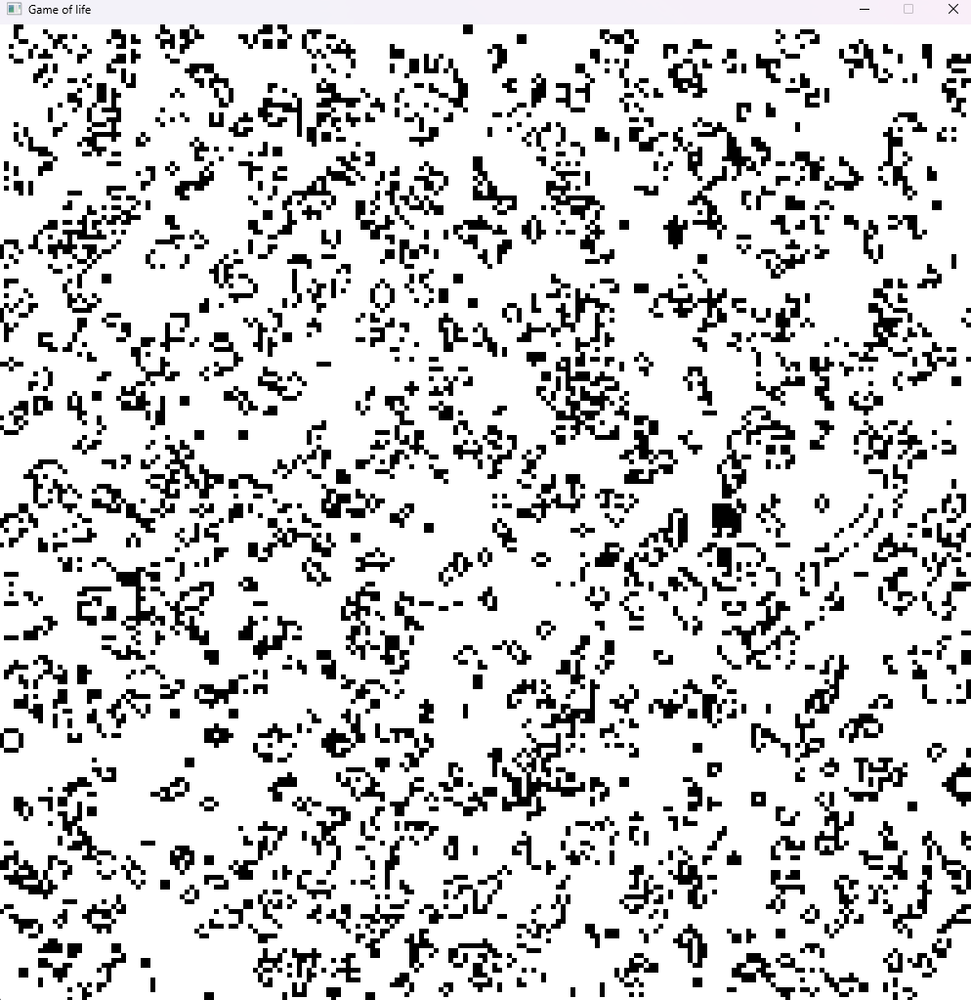

# Game of life

## Description

This is a simple implementation of Conway's Game of Life in Rust.

## Usage

if you have cargo installed, you can run the following commands to build and run the program:

```
cargo build

cargo run 
```

if you don't have cargo installed, you can run the following commands to build and run the program:

```
.\target\release\game_of_life.exe
```

## Controls

- `Escape` to exit the simulation
- `Space` to pause the simulation

## Rules

- Any live cell with fewer than two live neighbours dies, as if by underpopulation.
- Any live cell with two or three live neighbours lives on to the next generation.
- Any live cell with more than three live neighbours dies, as if by overpopulation.
- Any dead cell with exactly three live neighbours becomes a live cell, as if by reproduction.

## Screenshots

